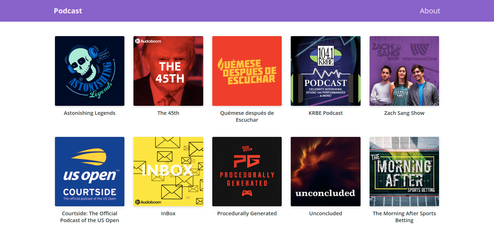

# nextJs-course
Podcast web app based on [AudioBomm](https://audioboom.com) API.

Uses NextJs for ReactJs. Course at @platzi.

[Live Preview](https://podcasts-nextjs-blush.vercel.app)

## ScreenShot

## Install

**For development**

- `npm install`
- `npm run dev`

**For deployment**

- `npm install`
- `npm run build && npm run start`

## License

MIT License